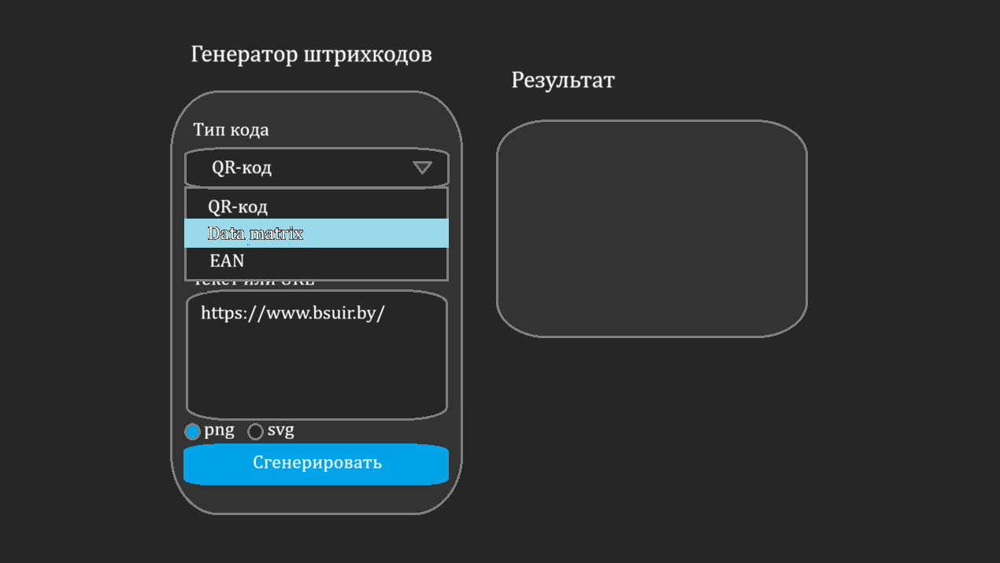
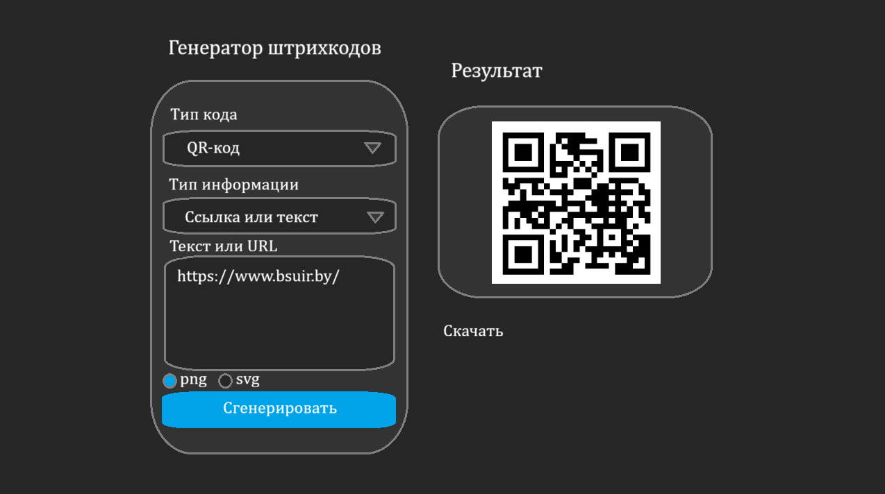
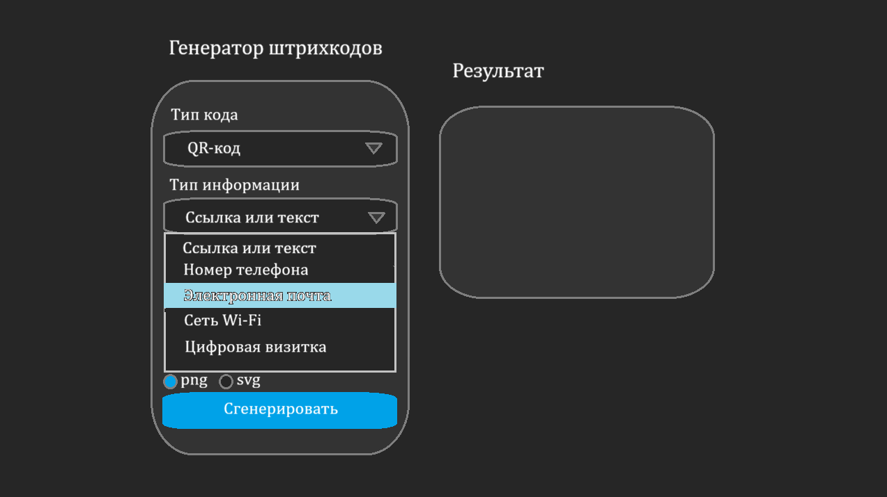
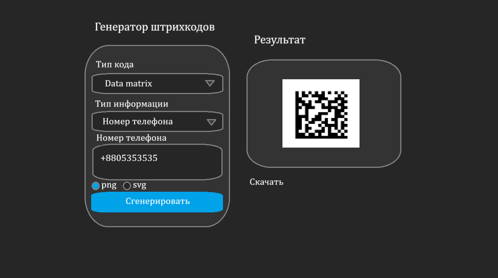
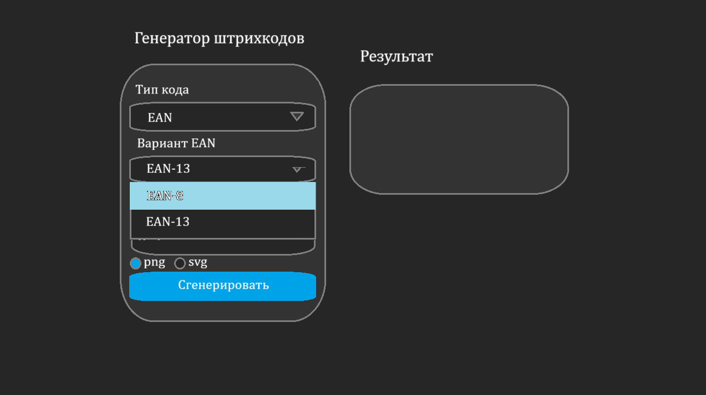
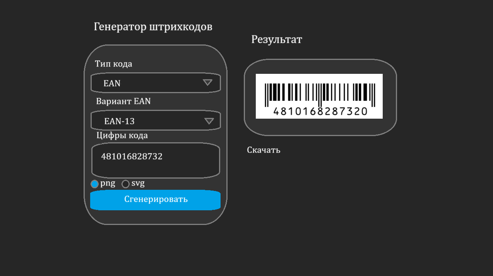

# Требования к проекту

\---

### Содержание

1. [Введение](#1)
2. [Требования пользователя](#2)  
2.1. [Программные интерфейсы](#2.1)  
2.2. [Интерфейс пользователя](#2.2)  
2.3. [Характеристики пользователей](#2.3)  
3. [Системные требования](#3)  
3.1 [Функциональные требования](#3.1)  
3.2 [Нефункциональные требования](#3.2)  
3.2.1 [Атрибуты качества](#3.2.1)  
3.2.2 [Ограничения](#3.2.2)  

### 1\. Введение 

Данное веб-приложение представляет собой программный инструмент, предназначенный для автоматизированной генерации графических идентификаторов различных типов: линейных штрихкодов (EAN), двухмерных матричных кодов (Data Matrix) и матричных кодов быстрого отклика (QR-код). Основная задача сервиса — обеспечить пользователю удобный интерфейс для преобразования текстовой или цифровой информации в стандартизированные графические форматы, пригодные для печати, логистического учета и маркетинговых целей.

### 2\. Требования пользователя 

#### 2.1. Программные интерфейсы 

Для реализации проекта используется современный стек веб-разработки на базе Node.js. Серверная часть построена на фреймворке Express, графический интерфейс реализован на «чистом» стеке (Vanilla HTML/CSS/JS). Взаимодействие фронтенда с API сервера осуществляется через Fetch API. Для создания графических идентификаторов интегрированы специализированные библиотеки: qrcode — для формирования QR-кодов; bwip-js — для генерации сложных форматов (EAN-13, EAN-8, Data Matrix).

#### 2.2. Интерфейс пользователя 

* Пример выбора типа штрихкода

На данном макете демонстрируется возможность выбора типа штрихкода.

* Пример генерации QR-кода

На данном макете демонстрируется пример генерации QR-кода. Также демонстрируются возможности выбора формата получаемого изображения и скачивания полученного изображения со штрихкодом.

* Пример выбора типа кодируемой информации в QR-код

На данном макете демонстрируется возможность выбора типа кодируемой информации в QR-код (такие же типы доступны для data matrix) 

* Пример генерации data matrix

На данном макете демонстрируется пример генерации data matrix.

* Пример выбора типа EAN

На данном макете демонстрируется возможность выбора типа EAN 

* Пример генерации EAN

На данном макете демонстрируется пример генерации EAN-13.

#### 2.3. Характеристики пользователей 

* Целевая аудитория

Приложение ориентировано на пользователей, чья деятельность связана с учетом, маркировкой и идентификацией объектов

### 3\. Системные требования 

#### 3.1. Функциональные требования 

Пользователю предоставляются следующие возможности:

1. Выбор типа генерируемого штрихкода: QR-code, data matrix или EAN.
2. Выбор типа кодируемой информации для QR-code и data matrix.
3. Выбор типа EAN: EAN-13 или EAN-8.
4. Выбор формата получаемого изображения: PNG или SVG.
5. Скачивание полученного изображения.

#### 3.2. Нефункциональные требования 

##### 3.2.1 Атрибуты качества 

* Использование выдержанной для всего приложения цветовой гаммы.
* Однозначные названия и/или общепринятые обозначения функциональных элементов пользовательского интерфейса.

##### 3.2.2 Ограничения 

Запуск приложения производится под любой операционной системой на которой установлен Node.js.

